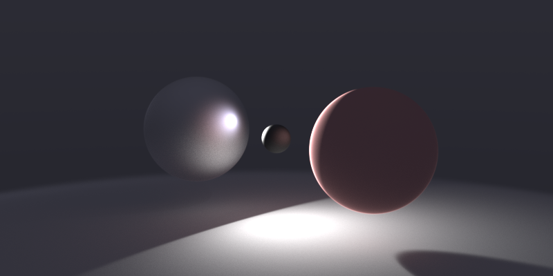

```
camera
	p -2.4 .6 -3
	d
		f 2 -.3 3
		u 0 1 0
	w 1600
	h 800
	c 2000
	iter 5
	noise 0.3

sphere
	p 0 -200 0
	r 200
	mat
		c .9 .9 .9
		shine .25

sphere
	p 0 0 0
	r .25
	mat
		c .3 .3 .9
		shine .5

sphere
	p 0 0 1
	r .4
	mat
		c .3 .9 .3
		shine .25

sphere
	p 0.5 0 2.2
	r .6
	mat
		c .9 .3 .3
		shine 0

sphere
	p 2.1 0 3.2
	r 1
	mat
		c .75 .75 .75
		shine 1

done
```
